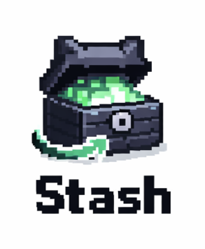
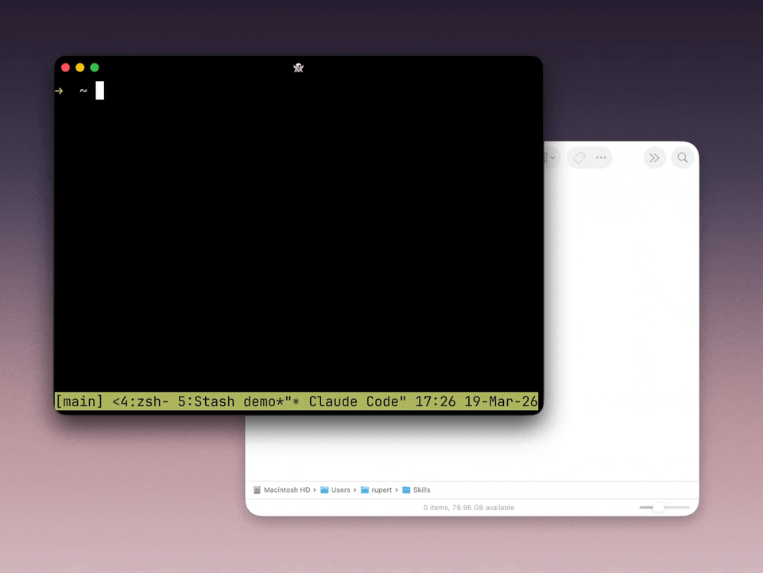

[](https://www.npmjs.com/package/@telepath-computer/stash)
[](LICENSE)

**Conflict-free synced folders.** Multiple people, agents, and machines can edit the same directory, then converge with a single `stash sync`.

[Read the launch post →](https://telepath.computer/blog/stash/)



## Quick Start

```bash
npm install -g @telepath-computer/stash
cd dir-to-sync/ && stash connect github
stash start
```

> [!TIP]
> Run `stash start` once and forget about it — stash will keep your directories in sync in the background, even across restarts.

## Using the GitHub provider

The only sync endpoint right now is a GitHub repo. You'll need a personal access token — we recommend a **fine-grained token** scoped to only the repos you use with stash.

[Create a new repo on GitHub](https://github.com/new) to use for sync, then connect it:

```bash
cd dir-to-sync/
stash connect github
```

Stash will prompt for your repo and token (you'll only need to enter the token once). Then choose how to sync:

```bash
stash sync          # Sync once
stash watch         # Watch and sync continuously in the foreground
stash start         # Sync all stashes in the background, resumes on restart
```

### Creating a GitHub token

1. Go to [github.com/settings/personal-access-tokens/new](https://github.com/settings/personal-access-tokens/new)
2. Give it a name (e.g. `stash`)
3. Under **Repository access**, select the repo(s) you want to use with stash
4. Under **Repository permissions**, set **Contents** to **Read and write**
5. Click **Generate token** and copy it

Use this token when running `stash setup github`. A classic token with the `repo` scope also works.

## How it works

- **One operation.** `stash sync` pushes local changes, pulls remote changes, and merges concurrent edits in a single pass.
- **Smart text merging.** Different-region edits combine cleanly. Overlapping edits preserve both sides instead of silently dropping content.
- **Binary files** use last-modified-wins.
- **Automatic tracking.** Every file in the directory is synced except dotfiles, dot-directories, symlinks, and local-only `.stash/` metadata.

## Commands

| Command | Description |
|---|---|
| `stash connect <provider>` | Initialize a stash and connect a provider |
| `stash disconnect` | Disconnect from providers and stop syncing |
| `stash sync` | Sync once |
| `stash watch` | Watch and sync continuously in the foreground |
| `stash start` | Start background sync (resumes on restart) |
| `stash stop` | Stop and uninstall the background service |
| `stash status` | Show status of the current stash |
| `stash status --all` | Show status of all stashes |
| `stash setup <provider>` | Update provider credentials |
| `stash config set <key> <value>` | Set a per-stash config value |
| `stash config get <key>` | Get a per-stash config value |

## Using stash with git

> [!WARNING]
> By default, stash refuses to sync a directory that contains `.git/`. Branch switches look like mass file edits to stash and can push destructive changes to the remote.

If you don't need git in that directory, remove `.git/`. If you intentionally want both, run:

```bash
stash config set allow-git true
```

Keep stash pinned to one branch and don't switch branches while it's active. Behaviour in that configuration is undefined — make a backup.

## FAQ

**Will stash delete or overwrite my existing files?**

Not blindly. On first sync, local and remote content are reconciled rather than replaced wholesale. The result becomes the baseline for future syncs.

**Can I use the same repo with both stash and git?**

Yes, but not on the same machine and directory. Stash syncs the working tree directly to `main` through the GitHub API and does not understand local git state.

**Does stash use branches or PRs?**

No. Stash reads and writes `main` directly.
